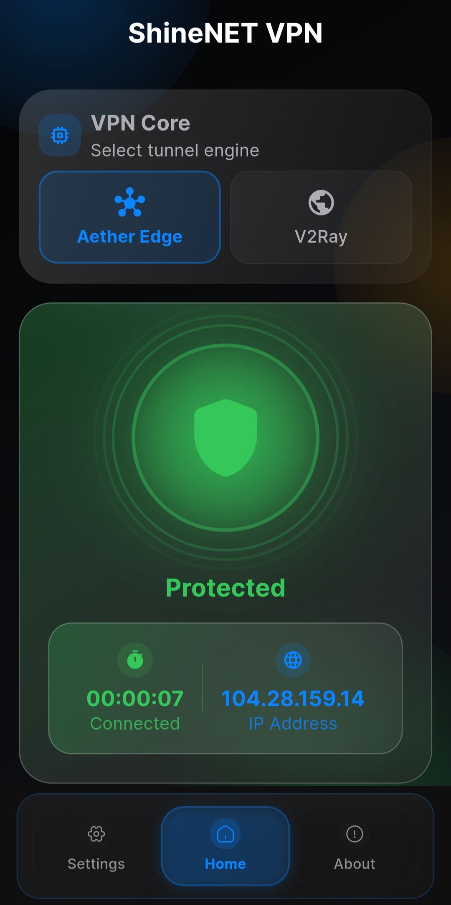

  
  
  # 🌐 **ShineNET VPN**
  
  **Your Gateway to Internet Freedom**
  
  
  
  
  
  [English](#english) | [فارسی](#فارسی) | [中文](#中文) | [Русский](#русский)
  

---

## English

### 🚀 About ShineNET VPN

ShineNET VPN is a **free, open-source** VPN application designed to provide secure and unrestricted internet access. Built with modern Flutter technology, it offers a seamless experience across Android devices with enterprise-grade security and privacy protection.

### 📸 Screenshots

  

### ✨ Key Features

- 🔒 **Industry-Standard Encryption** - VMess, VLESS+XTLS, Trojan, Shadowsocks protocols
- ⚡ **High-Speed Servers** - Optimized for performance
- 🌍 **Global Server Network** - Multiple server locations
- 📱 **Modern UI/UX** - Clean, intuitive interface
- 🔄 **Auto-Connect** - Intelligent server selection
- 🛡️ **Privacy Focused** - No logs, no tracking
- 🆓 **Completely Free** - No hidden costs or subscriptions
- 📂 **Open Source** - Transparent and trustworthy
- 🛡️ **Aether Integration** - MASQUE, WireGuard, WARP protocols via Cloudflare WARP

### 🔐 Security

ShineNET VPN uses industry-standard encryption protocols:

#### V2Ray/Xray Protocols
- **VMess**: AES-128-GCM / ChaCha20-Poly1305 encryption
- **VLESS + XTLS**: AES-256-GCM / ChaCha20-Poly1305 with reduced latency
- **Trojan**: TLS 1.3 based, mimics HTTPS traffic
- **Shadowsocks**: AEAD ciphers (AES-256-GCM, ChaCha20)

**Note**: V2Ray server configurations are sourced from publicly available community lists and all connections use TLS encryption.

#### Aether Protocols (Cloudflare WARP)
- **MASQUE**: HTTP/3 tunnel over QUIC protocol
- **WireGuard**: Modern, fast VPN protocol
- **WARP-on-WARP**: Double-layer encryption for enhanced security

For detailed security information, see our [Security Policy](SECURITY.md).

### 📥 Download

**Latest Version: v1.3.9**

### 🛠️ Installation Guide

1. **Download** the latest APK from [Releases](https://github.com/shayanheidari01/ShineNETVPN/releases/latest)
2. **Enable** "Install from Unknown Sources" in your device settings
3. **Install** the downloaded APK file
4. **Open** ShineNET VPN and enjoy secure browsing!

### 📱 System Requirements

- Android 5.0 (API level 21) or higher
- 50MB free storage space
- Internet connection

### 🤝 Contributing

We welcome contributions! Please feel free to submit pull requests, report bugs, or suggest new features.

**Security Notice**: If you discover a security vulnerability, please follow our [Security Policy](SECURITY.md) instead of opening a public issue.

### 📞 Support

- **Email**: shinenetvpn@gmail.com
- **Telegram**: [@ShineNETVPN](https://t.me/ShineNETVPN)
- **Issues**: [GitHub Issues](https://github.com/shayanheidari01/ShineNETVPN/issues)

### 🔐 Privacy Policy

See our full privacy policy here: [PRIVACY.md](PRIVACY.md)

### Acknowledgements

Special thanks to the [CluvexStudio Aether project](https://github.com/CluvexStudio/Aether) for its open-source work and inspiration.

### 📄 License

This project is licensed under the MIT License - see the [LICENSE](LICENSE) file for details.

---

## فارسی

### 🚀 درباره ShineNET VPN

ShineNET VPN یک اپلیکیشن **رایگان و متن‌باز** است که برای ارائه دسترسی امن و نامحدود به اینترنت طراحی شده است. با استفاده از تکنولوژی مدرن Flutter ساخته شده و تجربه‌ای روان در دستگاه‌های اندروید با امنیت و حفظ حریم خصوصی سطح سازمانی ارائه می‌دهد.

### 📸 اسکرین‌شات‌ها

  

### ✨ ویژگی‌های کلیدی

- 🔒 **رمزنگاری استاندارد صنعتی** - پروتکل‌های VMess، VLESS+XTLS، Trojan، Shadowsocks
- ⚡ **سرورهای پرسرعت** - بهینه‌سازی شده برای عملکرد
- 🌍 **شبکه سرور جهانی** - چندین مکان سرور
- 📱 **رابط کاربری مدرن** - طراحی تمیز و شهودی
- 🔄 **اتصال خودکار** - انتخاب هوشمند سرور
- 🛡️ **متمرکز بر حریم خصوصی** - بدون لاگ، بدون ردیابی
- 🆓 **کاملاً رایگان** - بدون هزینه پنهان یا اشتراک
- 📂 **متن‌باز** - شفاف و قابل اعتماد
- 🛡️ **یکپارچه Aether** - پروتکل‌های MASQUE، WireGuard، WARP از طریق Cloudflare WARP

### 🔐 امنیت

ShineNET VPN از پروتکل‌های رمزنگاری استاندارد صنعتی استفاده می‌کند:

#### پروتکل‌های V2Ray/Xray
- **VMess**: رمزنگاری AES-128-GCM / ChaCha20-Poly1305
- **VLESS + XTLS**: رمزنگاری AES-256-GCM / ChaCha20-Poly1305 با تاخیر کمتر
- **Trojan**: مبتنی بر TLS 1.3، ترافیک HTTPS را تقلید می‌کند
- **Shadowsocks**: رمزهای AEAD (AES-256-GCM, ChaCha20)

**توجه**: پیکربندی سرورهای V2Ray از لیست‌های عمومی جامعه جمع‌آوری می‌شوند و تمام اتصالات از TLS استفاده می‌کنند.

#### پروتکل‌های Aether (Cloudflare WARP)
- **MASQUE**: تونل HTTP/3 از پروتکل QUIC
- **WireGuard**: پروتکل مدرن و سریع VPN
- **WARP-on-WARP**: رمزنگاری دو لایه برای امنیت بیشتر

برای اطلاعات امنیتی جزئی، [سیاست امنیتی](SECURITY.md) ما را ببینید.

### 📥 دانلود

**آخرین نسخه: v1.3.9**

### 🛠️ راهنمای نصب

1. **دانلود** آخرین APK از [انتشارات](https://github.com/shayanheidari01/ShineNETVPN/releases/latest)
2. **فعال‌سازی** "نصب از منابع ناشناخته" در تنظیمات دستگاه
3. **نصب** فایل APK دانلود شده
4. **باز کردن** ShineNET VPN و لذت بردن از مرور امن!

### 📞 پشتیبانی

- **ایمیل**: shinenetvpn@gmail.com
- **تلگرام**: [@ShineNETVPN](https://t.me/ShineNETVPN)
- **مسائل**: [GitHub Issues](https://github.com/shayanheidari01/ShineNETVPN/issues)

---

## 中文

### 🚀 关于 ShineNET VPN

ShineNET VPN 是一款**免费开源**的 VPN 应用程序，旨在提供安全无限制的互联网访问。采用现代 Flutter 技术构建，为 Android 设备提供企业级安全和隐私保护的流畅体验。

### 📸 截图

  

### ✨ 主要特性

- 🔒 **行业标准加密** - VMess、VLESS+XTLS、Trojan、Shadowsocks 协议
- ⚡ **高速服务器** - 性能优化
- 🌍 **全球服务器网络** - 多个服务器位置
- 📱 **现代化界面** - 简洁直观的设计
- 🔄 **自动连接** - 智能服务器选择
- 🛡️ **注重隐私** - 无日志，无追踪
- 🆓 **完全免费** - 无隐藏费用或订阅
- 📂 **开源** - 透明可信
- 🛡️ **Aether 集成** - 通过 Cloudflare WARP 支持 MASQUE、WireGuard、WARP 协议

### 🔐 安全性

ShineNET VPN 使用行业标准加密协议：

#### V2Ray/Xray 协议
- **VMess**: AES-128-GCM / ChaCha20-Poly1305 加密
- **VLESS + XTLS**: AES-256-GCM / ChaCha20-Poly1305 加密，延迟更低
- **Trojan**: 基于 TLS 1.3，模拟 HTTPS 流量
- **Shadowsocks**: AEAD 加密 (AES-256-GCM, ChaCha20)

**注意**: V2Ray 服务器配置来自公开的社区列表，所有连接使用 TLS 加密。

#### Aether 协议 (Cloudflare WARP)
- **MASQUE**: 基于 QUIC 协议的 HTTP/3 隧道
- **WireGuard**: 现代、快速的 VPN 协议
- **WARP-on-WARP**: 双层加密增强安全性

详细安全信息请参阅我们的[安全政策](SECURITY.md)。

### 📥 下载

**最新版本: v1.3.9**

---

## Русский

### 🚀 О ShineNET VPN

ShineNET VPN — это **бесплатное приложение с открытым исходным кодом**, предназначенное для обеспечения безопасного и неограниченного доступа в интернет. Построенное на современной технологии Flutter, оно обеспечивает беспрепятственную работу на Android-устройствах с корпоративным уровнем безопасности и защиты конфиденциальности.

### 📸 Скриншоты

  

### ✨ Ключевые особенности

- 🔒 **Отраслевое шифрование** - Протоколы VMess, VLESS+XTLS, Trojan, Shadowsocks
- ⚡ **Высокоскоростные серверы** - Оптимизированы для производительности
- 🌍 **Глобальная сеть серверов** - Множество локаций серверов
- 📱 **Современный интерфейс** - Чистый, интуитивный дизайн
- 🔄 **Автоподключение** - Интеллектуальный выбор сервера
- 🛡️ **Ориентированность на приватность** - Без логов, без отслеживания
- 🆓 **Полностью бесплатно** - Без скрытых затрат или подписок
- 📂 **Открытый исходный код** - Прозрачно и надежно
- 🛡️ **Интеграция Aether** - Протоколы MASQUE, WireGuard, WARP через Cloudflare WARP

### 🔐 Безопасность

ShineNET VPN использует отраслевые стандарты шифрования:

#### Протоколы V2Ray/Xray
- **VMess**: Шифрование AES-128-GCM / ChaCha20-Poly1305
- **VLESS + XTLS**: Шифрование AES-256-GCM / ChaCha20-Poly1305 с минимальной задержкой
- **Trojan**: На основе TLS 1.3, имитирует HTTPS-трафик
- **Shadowsocks**: AEAD шифры (AES-256-GCM, ChaCha20)

**Примечание**: Конфигурации серверов V2Ray берутся из публичных списков сообщества, все соединения используют TLS.

#### Протоколы Aether (Cloudflare WARP)
- **MASQUE**: Туннель HTTP/3 через протокол QUIC
- **WireGuard**: Современный быстрый VPN-протокол
- **WARP-on-WARP**: Двухслойное шифрование для повышенной безопасности

Подробную информацию о безопасности смотрите в нашей [политике безопасности](SECURITY.md).

### 📥 Скачать

**Последняя версия: v1.3.9**

---

  
  ### 🌟 Star this repository if you find it helpful!
  
  **Made with ❤️ by the ShineNET Team**
  
  © 2026 ShineNET VPN. All rights reserved.
  

